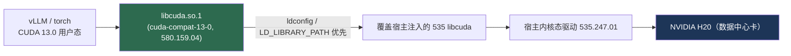

# 在 535 宿主驱动上从源码全编译 vLLM（CUDA 13.0 栈）

> 适用场景：容器内宿主 GPU 驱动只到 **CUDA 12.2（驱动 535.x）**，但要从源码全编译并运行
> **CUDA 13.0** 版 vLLM。通过 **前向兼容（Forward Compatibility）** 免升宿主驱动，
> 再补齐 **rust / gcc / cuda toolkit** 三类构建工具，即可本地全编译。

本文按实际跑通的顺序，分四步说明，每步都讲清「做什么 / 为什么 / 原理」。
全部步骤已脚本化，见 `setup-dev-env.sh`（一键安装）与 `dev-env.sh`（每次进环境 source）。

---

## 0. 本机已验证基线

| 项 | 实测值 |
|---|---|
| GPU | NVIDIA **H20**（数据中心卡，支持前向兼容 ✅）|
| 宿主内核态驱动 | **535.247.01**（= CUDA 12.2 上限）|
| 前向兼容包 | **cuda-compat-13-0-580.159.04**，提供用户态 `libcuda.so 580.159.04` |
| 系统 CUDA toolkit | **`/usr/local/cuda-13.0`**，nvcc **release 13.0 V13.0.88** |
| 编译器 | **gcc-toolset-12**（gcc **12.2.1**，满足 C++20）|
| Rust | **1.95.0**（仓库 `rust-toolchain.toml` 指定）|
| PyTorch | **2.11.0+cu130**（`torch.version.cuda = 13.0`）|
| Python | 3.12（uv 管理的 `.venv`）|
| OS | TencentOS 3.2（el8 / RHEL 系）|

> 核心思路：**整个栈锁死在 CUDA 13.0**，靠 compat 解决「能不能跑」，靠 toolkit/gcc/rust 解决「能不能编」。

---

## 第 1 步：安装兼容包（cuda-compat-13-0）

### 做什么
```bash
dnf config-manager --add-repo https://developer.download.nvidia.com/compute/cuda/repos/rhel8/x86_64/cuda-rhel8.repo
dnf install -y cuda-compat-13-0
ldconfig   # 刷新缓存，使 compat 的 libcuda 全局优先
```

### 为什么
宿主驱动 535 的用户态 `libcuda.so` 只支持到 CUDA 12.2，直接跑 CUDA 13 栈会报
`CUDA error 803 (SYSTEM_DRIVER_MISMATCH)`。而我们**不能也不应在容器内换宿主驱动**
（会与宿主注入冲突，甚至让整机起不来）。

### 原理：前向兼容 = 只换「驱动 API 层」的用户态库
`cuda-compat-13-0` 内含一套**新版用户态 `libcuda.so`（580.159.04）**，装在
`/usr/local/cuda-13.0/compat`，并经 `/etc/ld.so.conf.d/*cuda*.conf` 注册。
`ldconfig` 缓存中它**优先于宿主 535** 被解析：

```
libcuda.so.1 => /usr/local/cuda-13.0/compat/libcuda.so.1   (580.159.04)  ← 优先
libcuda.so.1 => /lib64/libcuda.so.1                        (宿主 535)
```

进程看到的是「580 的驱动 API」，真正与硬件交互的内核态驱动仍是宿主 535 —— 这就是前向兼容的本质。



### 两个前提（不满足则前向兼容无效）
| 前提 | 要求 | 本机 |
|---|---|---|
| GPU 类型 | 前向兼容**仅支持数据中心卡**（A100/H100/H20…），消费级 GeForce 不支持 | H20 ✅ |
| 基础驱动 | 宿主驱动 **≥ r525** | 535 ✅ |

### 验证
```bash
ldconfig -p | grep 'libcuda.so.1'        # 第一条应来自 .../cuda-13.0/compat
python -c "import torch; print(torch.version.cuda, torch.cuda.is_available())"   # 13.0 True
python -c "import torch; x=torch.randn(1024,1024,device='cuda'); print((x@x).sum().item())"
```

> ⚠️ 概念澄清：compat **只换 `libcuda.so`（驱动 API 层）**，不提供 `libcudart`（CUDA Runtime 层）。
> runtime 由 torch 自带的 `nvidia-*-cu13` wheel 提供；编译期的 `libcudart.so` 软链则由第 4 步的 toolkit 提供。

---

## 第 2 步：安装 Rust 开发环境

### 做什么
```bash
# (1) 换源：rustup 安装器与工具链走 rsproxy.cn 镜像（不换会非常慢甚至超时）
export RUSTUP_DIST_SERVER="https://rsproxy.cn"
export RUSTUP_UPDATE_ROOT="https://rsproxy.cn/rustup"
export CARGO_REGISTRIES_CRATES_IO_PROTOCOL=sparse
curl --proto '=https' --tlsv1.2 -sSf https://rsproxy.cn/rustup-init.sh | sh -s -- -y --default-toolchain none
source "$HOME/.cargo/env"

# (2) 换 crates 镜像：写入 ~/.cargo/config.toml（sparse 协议）
cat >> "$HOME/.cargo/config.toml" <<'EOF'
[source.crates-io]
replace-with = "rsproxy-sparse"
[source.rsproxy-sparse]
registry = "sparse+https://rsproxy.cn/index/"
[net]
git-fetch-with-cli = true
EOF

# (3) 切换到仓库指定版本（rust-toolchain.toml: channel = "1.95"）
rustup toolchain install 1.95
rustup default 1.95
rustc --version    # 应为 1.95.x
```

### 为什么
vLLM 部分组件用 **Rust** 实现，构建后端是 **setuptools-rust**。源码安装时若没有可用的
`cargo`，会直接报 `ModuleNotFoundError: setuptools_rust` 或 `cargo: command not found`，
configure 阶段就挂。而**默认从官方源拉取在国内极慢**，rustup 工具链动辄几十 MB、crates 依赖上百个，
不换源经常超时失败——所以**换源是必做项**。

### 原理：两类源 + 钉死版本
- **rustup 安装源**（`RUSTUP_DIST_SERVER` / `RUSTUP_UPDATE_ROOT`）：决定 rustup 安装器自身和
  工具链二进制（rustc/cargo）从哪下。指向 `rsproxy.cn` 后下载走国内 CDN，秒级完成。
  安装时加 `--default-toolchain none`，**先不装默认版本**，留给第 (3) 步精确指定。
- **cargo crates 镜像**（`~/.cargo/config.toml` 的 `replace-with`）：决定编译时第三方 crate 从哪拉。
  配合 `sparse` 稀疏索引协议，只拉需要的 crate 元数据（而非整库克隆），国内网络下显著更快更稳。
- **钉死版本**：仓库根目录 `rust-toolchain.toml` 用 `channel = "1.95"` 指定工具链版本。
  虽然 `rustup` 进入目录时会**自动按它切换**，但首次需先 `rustup toolchain install 1.95` 把该版本装下来；
  `rustup default 1.95` 再设为默认，保证 `which cargo` 全局可用、构建结果可复现。

> 镜像可换成清华 TUNA、中科大 USTC 等，原理相同。`rsproxy.cn`（字节）同时提供 rustup 与 crates 镜像，最省事。

---

## 第 3 步：升级 gcc（gcc-toolset-12，满足 C++20）

### 做什么
```bash
dnf install -y gcc-toolset-12          # 含 gcc/g++ 12.x、libstdc++、binutils
source /opt/rh/gcc-toolset-12/enable   # 仅当前 shell 生效，不动系统默认 gcc
gcc --version                          # 应显示 12.x

# 让 cmake 与 nvcc 都用这套新 gcc（关键，否则 nvcc 可能回退系统 8.5）
export CC=$(command -v gcc)
export CXX=$(command -v g++)
export CMAKE_CUDA_HOST_COMPILER=$CXX
```

### 为什么
vLLM 顶层 `CMakeLists.txt` 把 C++/CUDA 标准设为 **C++20**：

```16:21:/root/vllm/CMakeLists.txt
set(CMAKE_CXX_STANDARD 20)
set(CMAKE_CXX_STANDARD_REQUIRED ON)
set(CMAKE_CUDA_STANDARD 20)
set(CMAKE_CUDA_STANDARD_REQUIRED ON)
set(CMAKE_HIP_STANDARD 20)
set(CMAKE_HIP_STANDARD_REQUIRED ON)
```
而 TencentOS 3.2 系统默认 `gcc 8.5`，连 C++17 都不完整。报「不支持 C++17」只是表象，
**根因是 gcc 太老**——完整 C++20 需 **gcc ≥ 11**（推荐 12/13）。

### 原理：用并行工具链，绝不动系统 gcc
> ⚠️ **切勿 `dnf update gcc`**：el8 系统工具链锁死在 8.5，大量系统组件依赖它，强替会破坏系统。

官方做法是装 **gcc-toolset**（Software Collections）：它装在 `/opt/rh/`，**与系统默认 gcc 并存**，
只在 `source enable` 后于当前 shell 临时进入 PATH，退出即恢复，对系统零污染。
nvcc 对 host gcc 有版本上限（CUDA 13 支持 gcc 上限约到 14），故 **gcc-toolset-12/13 都安全，推荐 12（最稳）**。

> 只 `source enable` 还不够：cmake/nvcc 可能仍探测到系统 8.5，必须显式导出
> `CC/CXX/CMAKE_CUDA_HOST_COMPILER`，把 host 编译器钉死到新 gcc。

---

## 第 4 步：安装 CUDA 编译工具链（cuda-toolkit-13-0）

### 做什么
```bash
# 只装 toolkit，绝不装 cuda / cuda-drivers（那会拉新驱动顶掉宿主 535）
dnf install -y cuda-toolkit-13-0
# 若 meta 包 No match，可点名装编译必需组件：
# dnf install -y cuda-nvcc-13-0 cuda-cudart-devel-13-0 cuda-crt-13-0 cuda-cccl-13-0 \
#   cuda-nvrtc-devel-13-0 libcublas-devel-13-0 libcusparse-devel-13-0 \
#   libcusolver-devel-13-0 libcurand-devel-13-0 libcufft-devel-13-0

export CUDA_HOME=/usr/local/cuda-13.0
export CUDACXX=$CUDA_HOME/bin/nvcc
export CUDA_TOOLKIT_ROOT_DIR=$CUDA_HOME
export PATH=$CUDA_HOME/bin:$PATH
nvcc --version    # 必须 release 13.0，而非系统旧 12.1
```

### 为什么（踩坑的核心）
本地全编译需要**与 torch cu130 匹配的 nvcc + 完整的 CUDA 开发库**。这里有两个连环坑：

1. **nvcc 版本错配**：系统默认 PATH 命中 `/usr/local/cuda/bin/nvcc = 12.1`，
   用它编面向 CUDA 13 的 vLLM，头文件/ABI 全对不上，必挂。
2. **pip 的 cu13 是「运行时」不是「开发包」**：`nvidia-*-cu13` wheel 只发带版本号的
   `libcudart.so.13`，**没有无版本号软链 `libcudart.so`、没有静态库**。cmake（torch 的
   `Caffe2Config.cmake`）链接时找不到 `CUDA_CUDART_LIBRARY`，报
   `Could NOT find CUDA (missing: CUDA_CUDART_LIBRARY)`。

### 原理：系统完整 toolkit 才补齐「开发软链」
`cuda-toolkit-13-0` 装到 `/usr/local/cuda-13.0`，提供 **nvcc 13.0** 以及关键的
**开发用软链与头文件**：

```
/usr/local/cuda-13.0/bin/nvcc                 # release 13.0
/usr/local/cuda-13.0/lib64/libcudart.so       # → libcudart.so.13（无版本号软链，cmake 链接要的就是它）
```

把 `CUDA_HOME` 指向它后，nvcc 版本对齐、cmake 也能定位 cudart，两个坑同时消除。

### 验证 + 全编译
```bash
ls -l /usr/local/cuda-13.0/lib64/libcudart.so   # 必须存在这条软链
cd /root/vllm
unset VLLM_USE_PRECOMPILED        # 全编译，不用预编译产物
uv pip install -e . --no-build-isolation 2>&1 | tee build-full.log
python -c "import vllm._C; print('vllm._C OK')"
```

> `--no-build-isolation` 不会自动装构建依赖，需先预装：
> ```bash
> uv pip install "cmake>=3.26.1" ninja "packaging>=24.2" \
>   "setuptools>=77.0.3,<81.0.0" "setuptools-scm>=8.0" "setuptools-rust>=1.9.0" wheel jinja2
> ```

---

## 第 5 步：编译加速与增量编译（ccache）

### 现象
第一遍能编过，但**改一点代码后第二遍重编几乎和首遍一样慢，看不到增量效果**。

### 根因（三个，第 3 个才是“CUDA 全编译”的真凶）
1. **没装 ccache**：vLLM 的 `setup.py` 会探测 `ccache`/`sccache`，探测到才注入
   `-DCMAKE_*_COMPILER_LAUNCHER`。没装时编译器无任何缓存，每次都从零编。
2. **`build/` 临时目录不持久**：源码 `pip install -e .` 的 `build_temp` 可能被清，
   CMake/Ninja 的「按时间戳跳过未改文件」式增量随之失效——这时**唯一能跨构建复用的就是 ccache**
   （它按源文件内容哈希缓存，不依赖 build 目录是否还在）。
3. **【真凶】ccache 版本太老（el8 dnf 默认 3.7.7），不缓存 CUDA**：
   CMake 编译 `.cu` 时会显式给 nvcc 传 **`-x cu`** 指定源语言。**ccache 3.x 不认识 `cu` 这个语言**，
   直接判 `Unsupported language: cu` → fallback 跑真实 nvcc，**完全不缓存**。
   于是 130 个 CUDA kernel（编译最慢的大头）每次全量重编，C++ 部分却能命中——
   表现就是「改一行 Python/C++ 也像在全编译」。用 `ccache -s` 能看到大量
   `unsupported source language`（≈ 你的 .cu 编译次数）即坐实此因。**修复要 ccache ≥ 4.x。**

### 做什么：装 ccache ≥ 4.x（dnf 的 3.7.7 没用，必须换）
```bash
# el8 dnf 只有 3.7.7，用官方静态二进制装 4.x：
ver=4.10.2; pkg=ccache-${ver}-linux-x86_64
url=https://github.com/ccache/ccache/releases/download/v${ver}/${pkg}.tar.xz
cd /tmp && { curl -fsSL -o c.tar.xz "$url" || curl -fsSL -o c.tar.xz "https://gh-proxy.com/$url"; }
tar xf c.tar.xz && install -m755 "$pkg/ccache" /usr/local/bin/ccache && hash -r
ccache --version          # 必须显示 4.x；/usr/local/bin 须在 PATH 中 /usr/bin 之前

export CCACHE_DIR=/root/.cache/ccache
ccache -M 50G                       # CUDA 目标文件大，缓存上限给足
ccache -o compiler_check=content    # 按编译器内容而非 mtime 判定，换工具链不误失效
ccache -o sloppiness=pch_defines,time_macros,include_file_mtime,include_file_ctime,gcno_cwd
ccache -o hash_dir=false            # 不把绝对路径计入哈希，跨临时 build 目录也能命中
```
> 一键脚本 `setup-dev-env.sh` 已内置「检测到 ccache<4 自动下载 4.x」逻辑，无需手动操作。
装好后**无需改任何编译命令**——`setup.py` 自动检测并启用：
```244:250:/root/vllm/setup.py
        elif is_ccache_available():
            cmake_args += [
                "-DCMAKE_C_COMPILER_LAUNCHER=ccache",
                "-DCMAKE_CXX_COMPILER_LAUNCHER=ccache",
                "-DCMAKE_CUDA_COMPILER_LAUNCHER=ccache",
                "-DCMAKE_HIP_COMPILER_LAUNCHER=ccache",
            ]
```

### 原理：ccache 按「内容哈希」缓存编译产物
ccache 包在编译器外层，先对**预处理后的源码 + 编译参数**算哈希，命中则直接吐出上次的 `.o`/`.cubin`，
跳过真正的编译。所以：
- 只改了文件 A，B/C 等未变的源文件第二遍**全部命中**，仅 A 真正重编 → 大幅提速。
- 即使 `build/` 被删、重新 `cmake configure`，ccache 仍按内容命中（这正是它比纯 CMake 增量更耐用的地方）。
- `hash_dir=false` + sloppiness 放宽时间戳，避免「换了临时目录/重新解压」导致的假性 miss。

### 并行度调优（配合 ccache）
```bash
export MAX_JOBS=360       # 总并行编译单元
export NVCC_THREADS=4     # 每个 nvcc 内部线程数
```
`setup.py` 实际并行单元数 ≈ `MAX_JOBS / NVCC_THREADS`。CUDA kernel 单文件编译重，给 nvcc 内部多线程
比单纯堆并行单元更省内存、更快。

### 验证命中
```bash
ccache -z                                   # 清零计数器
uv pip install -e . --no-build-isolation    # 改代码后重编
ccache -s                                   # 看 cache hit：第二遍应有大量 (direct)/(preprocessed) 命中
```
> 注意：**第一遍是“填充缓存”，必然慢**；从第二遍起才显著加速。首遍慢属正常，不要误判 ccache 没生效。

### 确诊「CUDA 没缓存」（最易踩的坑）
若第二遍 CUDA 仍全量重编，跑 `ccache -s` 看这一行：
```
unsupported source language   965     ← 约等于你的 .cu 编译次数 = CUDA 全没缓存
```
还可开日志看 ccache 拒绝的原因：
```bash
CCACHE_LOGFILE=/tmp/cc.log uv pip install -e . --no-build-isolation
grep -i 'unsupported\|language' /tmp/cc.log | head
# 若出现 "Unsupported language: cu" → 就是 ccache 3.x 不认 CMake 传的 -x cu，升级到 4.x 即解决
```

### 增量编译的正确姿势
| 改了什么 | 怎么做 | 是否重编 |
|---|---|---|
| 纯 Python（`vllm/*.py`） | 直接运行，editable 即时生效 | 否 |
| C++/CUDA 源（`csrc/*.cu` `*.cpp`） | `uv pip install -e . --no-build-isolation` | 仅改动文件，其余走 ccache 命中 |
| `CMakeLists.txt` / 依赖版本 | 同上（会重新 configure，编译仍走 ccache） | 配置重跑，编译大部分命中 |

---

## 三层根因链复盘（为什么是这四步）

| 层 | 症状 | 真正原因 | 对应步骤 |
|---|---|---|---|
| 运行时 / 驱动 API | CUDA 803 初始化失败 | 535 宿主驱动支持不到 CUDA 13 | 第 1 步 compat |
| 构建后端 | `setuptools_rust` / `cargo not found` | 缺 Rust 工具链 | 第 2 步 rust |
| C++ 编译器 | 「不支持 C++17/20」 | 系统 gcc 8.5 太老 | 第 3 步 gcc-toolset |
| nvcc / 链接库 | nvcc 错配 + `CUDA_CUDART_LIBRARY` not found | 系统 nvcc 12.1；pip cu13 缺开发软链 | 第 4 步 toolkit |

---

## 最佳开发范式

1. **整个栈锁死 CUDA 13.0**：torch `cu130`、系统 toolkit `13-0`、compat `13-0` 三者大版本一致，
   **绝不混入其它 CUDA 版本的 runtime**。
2. **始终显式 `--torch-backend=cu130`**，绝不用 `auto`（auto 会探测到 535 而错选低版本 wheel）。
3. **只装 `cuda-compat` + `cuda-toolkit`，绝不在容器内装 `cuda` / `cuda-drivers`**，避免顶掉宿主驱动。
4. **编译器用 gcc-toolset（≥11），绝不 `dnf update` 系统 gcc 8.5**：用并行工具链 `source enable`，不污染系统。
5. **工具链必须显式钉死**：编译前确认 `which nvcc` 指向 `/usr/local/cuda-13.0`、`gcc --version` 是 12.x、
   `torch.version.cuda` 是 13.0；任一不对就别开编。
6. **改 Python 即时生效**（editable 安装）；**只有改了 `csrc/` 下的 CUDA kernel 才需重编**。
7. **环境一律靠 `source /root/vllm/dev-env.sh` 进入**，把所有 `export` 固化在脚本里，
   避免手敲遗漏导致「重启后复发」。
8. **必装 ccache 做编译缓存**（见第 5 步）：改 C++/CUDA 后重编只编改动文件，其余命中缓存；
   第一遍填充缓存必然慢，第二遍起才提速，用 `ccache -s` 看命中率确认生效。

---

## 常见报错对照

| 报错 | 含义 | 处理 |
|---|---|---|
| `CUDA error 803 (SYSTEM_DRIVER_MISMATCH)` | compat 库未被优先加载 | 检查 `ldconfig -p \| grep libcuda` 顺序、`LD_LIBRARY_PATH` 是否含 compat 目录 |
| `CUDA error 804 (COMPAT_NOT_SUPPORTED_ON_DEVICE)` | 该卡不支持前向兼容 | 确认是数据中心卡（非 GeForce）|
| `不支持 C++17` / `requires C++20` | 系统 gcc 8.5 太老 | 第 3 步启用 `gcc-toolset-12` 并导出 `CC/CXX/CMAKE_CUDA_HOST_COMPILER` |
| `ModuleNotFoundError: setuptools_rust` / `cargo: command not found` | 缺 rust 或未预装构建依赖 | 第 2 步装 rust；预装构建依赖 |
| `Could NOT find CUDA (missing: CUDA_CUDART_LIBRARY)` | pip cu13 是运行时包，缺开发软链 | 第 4 步装系统 `cuda-toolkit-13-0`，`CUDA_HOME` 指向 `/usr/local/cuda-13.0` |
| nvcc 实为 12.1 | PATH 命中系统旧 toolkit | `export PATH=/usr/local/cuda-13.0/bin:$PATH`，确认 `nvcc --version` 是 13.0 |
